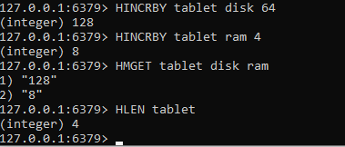
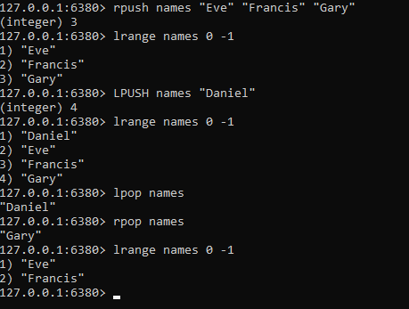

# Redis
Redis is an open source (BSD licensed), in-memory data structure store, used as a database, cache and message broker. It supports data structures such as strings, hashes, lists, sets, sorted sets with range queries, bitmaps, hyperloglogs, geospatial indexes with radius queries and streams.


Fun Fact: Redis means 
> "REmote DIctionary Server."
## Contents
+ **Installation**
+ **Before you start**
+ **Configure Redis Server on a different port**
+ **Read,Write,Update,Delete**
+ **Setting Time Limit on Keys**
+ **MSET,INCR,DECR**
+ **Hashes**
+ **List**
+ **Set**
+ **Sorted set**
+ **Plugging Redis With Python**
## Installing On Windows
Go to Redis official website https://redis.io/ and Scroll down to Windows section. You will see learn more. Click on it and you will get release page.Download the msi file and install it.
Start the **redis server** and **redis client** from the installation folder.
To check if everything's fine,use `ping` command.


## Installing On Linux 
Follow this link : https://www.javatpoint.com/redis-installation-on-ubuntu

## Before you start
There's another way to install redix i.e. using the zip file.I won't recommend that because in that case you've to run redis-server each time you start the redis-cli.If you've followed the way I described here,you needn't worry about it.

If you're on a Windows Operating System,try to use **WSL(Windows Subsystem for Linux)**(To enable WSL: https://bit.ly/3gMXyZQ) instead of cmd because WSL provides you with suggestions while writing.

**Configure Redis Server on a different port**

Redis server runs on default port 6379.But we can configure it to a different port.Run the following command in WSL to start the server on port 6380.
```
redis-server --port 6380
```
Open another WSL window and start the redis-cli on the same port
```
redis-cli -p 6380
```
And you're done.

## Write,Read,Update,Delete

You can easily set a value to a key.The command is very simple:

> set key value

To retrieve the value , 

> get key


We can update the value of a key

> set key new_value


And to delete a key

> del key


**Notice something curious**: We did not have to put quotation marks around a single string value we wanted to store.Both `set name afnan` and `set name "afnan"`are same in redis.Even we can wrap up both key and value by quotation or not,no problem with it.

But if we use multiple strings, we must use quotation i.e. `set "first name" afnan` or `set name "sihat afnan"`.Otherwise it will show error.

## Setting Time Limit on Keys
We can set a time limit to keys.it means that the key will be destroyed after a certain period of time.To set a time limit to an already declared key,

> EXPIRE key seconds

And to check how many seconds it has before being destroyed,

> TTL key


Or we can set the time while creating the key.

>  set key value [EX seconds]

Or there's another command called **SETEX**

> SETEX key seconds value 

If we want to use miliseconds,we can use **PSETEX**

> PSETEX key milliseconds value  

## MSET,INCR,DECR
using `MSET` , we can declare multiple keys in a same line.`INCR` and `DECR` are used to incrememnt and decrement a number.

![]images/incr.png)

We can increment or decrement by a fised value


## Hashes

In Redis, a Hash is a data structure that maps a string key with field-value pairs. Thus, Hashes are useful to represent objects. They key is the name of the Hash and the value represents a sequence of field-name field-value entries. We could describe a computer object as follows:

**computer name "MacBook Pro" year 2015 disk 512 ram 16**

We can use `HSET` command to create hashes and hget for extracting the key or values.If we want to declare all fields in one line,we've to use `HMSET`.Look at the following image


Also,we can increment/decrement the value of fields



## List
A List is created by using a Redis command that pushes data followed by a key name. There are two commands that we can use: RPUSH and LPUSH. If the key doesn't exist, these commands will return a new List with the passed arguments as elements. If the key already exists or it is not a List, an error is returned.
`RPUSH` inserts a new element at the end of the List (at the tail):

> RPUSH key value [value ...]

`LRANGE` extracts the elements of a list

> LRANGE key start stop

LPUSH behaves the same as RPUSH except that it inserts the element at the front of the List (at the header):

> LPUSH key value [value ...]

Then there are `lpop` and `rpop` to remove and return the first and last element from the list.



## Set
In Redis, a Set is similar to a List except that it doesn't keep any specific order for its elements and each element must be unique.We create a Set by using the SADD command that adds the specified members to the key:

> SADD key member [member ...]

We can remove members from a Set by using the `SREM` command:

> SREM key member [member ...]

To verify that a member is part of a Set, we can use the `SISMEMBER` command:

> SISMEMBER key member

To show all the members that exist in a Set, we can use the `SMEMBERS` command:

> SMEMBERS key


## Sorted Set
A Sorted Set is, in essence, a Set: it contains unique, non-repeating string members. However, while members of a Set are not ordered (Redis is free to return the elements in any order at every call of a Set), each member of a Sorted Set is linked to a floating point value called the score which is used by Redis to determine the order of the Sorted Set members. Since, every element of a Sorted Set is mapped to a value, it also has an architecture similar to Hash.

Using `ZADD` adds all the specified members with specified scores to the Sorted Set:

> zadd set_name score value,...

`ZRANGE` returns the specified range of members in the Sorted Set:

> ZRANGE key start stop [WITHSCORES]


## Plugging Redis With Python
There's a python client for redis.It can be installed via
```python
pip3 install redis
```
After installing,we can do all the things we did in redis-cli using Redis object.
```python
>>> import redis
>>> r = redis.Redis(host='localhost', port=6379, db=0)
```
To read and write data,
```python
>>> r.set('foo','bar')
True
>>> r.get('foo')
'bar'
```

This doc is being updated.Stay tuned
