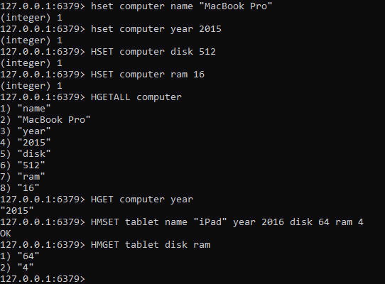
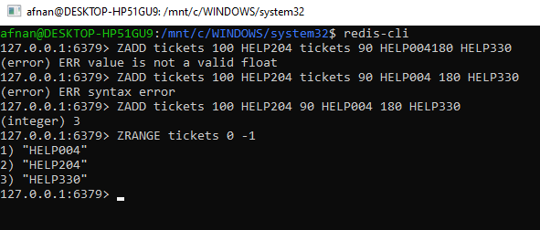
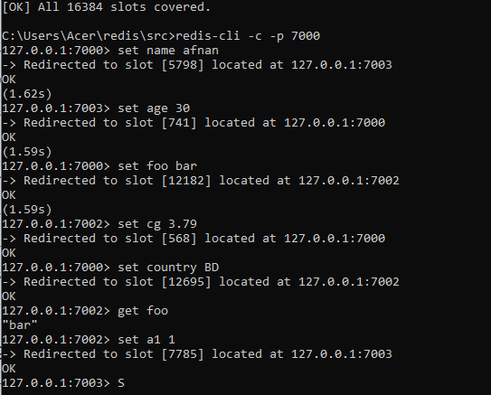

# Redis
Redis is an open source (BSD licensed), in-memory data structure store, used as a database, cache and message broker. It supports data structures such as strings, hashes, lists, sets, sorted sets with range queries, bitmaps, hyperloglogs, geospatial indexes with radius queries and streams.


Fun Fact: Redis means 
> "REmote DIctionary Server."
## Contents
+ **Installation**
+ **Before you start**
+ **Configure Redis Server on a different port**
+ **Read,Write,Update,Delete**
+ **Setting Time Limit on Keys**
+ **MSET,INCR,DECR**
+ **Hashes**
+ **List**
+ **Set**
+ **Sorted set**
+ **Plugging Redis With Python**
+ **Redis Cluster**
## Installing On Windows
Go to Redis official website https://redis.io/ and Scroll down to Windows section. You will see learn more. Click on it and you will get release page.Download the msi file and install it.
Start the **redis server** and **redis client** from the installation folder.
To check if everything's fine,use `ping` command.


## Installing On Linux 
Follow this link : https://www.javatpoint.com/redis-installation-on-ubuntu

## Before you start
There's another way to install redix i.e. using the zip file.I won't recommend that because in that case you've to run redis-server each time you start the redis-cli.If you've followed the way I described here,you needn't worry about it.

If you're on a Windows Operating System,try to use **WSL(Windows Subsystem for Linux)**(To enable WSL: https://bit.ly/3gMXyZQ) instead of cmd because WSL provides you with suggestions while writing.

**Configure Redis Server on a different port**

Redis server runs on default port 6379.But we can configure it to a different port.Run the following command in WSL to start the server on port 6380.
```
redis-server --port 6380
```
Open another WSL window and start the redis-cli on the same port
```
redis-cli -p 6380
```
And you're done.

## Write,Read,Update,Delete

You can easily set a value to a key.The command is very simple:

> set key value

To retrieve the value , 

> get key


We can update the value of a key

> set key new_value


And to delete a key

> del key


**Notice something curious**: We did not have to put quotation marks around a single string value we wanted to store.Both `set name afnan` and `set name "afnan"`are same in redis.Even we can wrap up both key and value by quotation or not,no problem with it.

But if we use multiple strings, we must use quotation i.e. `set "first name" afnan` or `set name "sihat afnan"`.Otherwise it will show error.

## Setting Time Limit on Keys
We can set a time limit to keys.it means that the key will be destroyed after a certain period of time.To set a time limit to an already declared key,

> EXPIRE key seconds

And to check how many seconds it has before being destroyed,

> TTL key


Or we can set the time while creating the key.

>  set key value [EX seconds]

Or there's another command called **SETEX**

> SETEX key seconds value 

If we want to use miliseconds,we can use **PSETEX**

> PSETEX key milliseconds value  

## MSET,INCR,DECR
using `MSET` , we can declare multiple keys in a same line.`INCR` and `DECR` are used to incrememnt and decrement a number.

![]images/incr.png)

We can increment or decrement by a fised value


## Hashes

In Redis, a Hash is a data structure that maps a string key with field-value pairs. Thus, Hashes are useful to represent objects. They key is the name of the Hash and the value represents a sequence of field-name field-value entries. We could describe a computer object as follows:

**computer name "MacBook Pro" year 2015 disk 512 ram 16**

We can use `HSET` command to create hashes and hget for extracting the key or values.If we want to declare all fields in one line,we've to use `HMSET`.Look at the following image



Also,we can increment/decrement the value of fields


## List
A List is created by using a Redis command that pushes data followed by a key name. There are two commands that we can use: RPUSH and LPUSH. If the key doesn't exist, these commands will return a new List with the passed arguments as elements. If the key already exists or it is not a List, an error is returned.
`RPUSH` inserts a new element at the end of the List (at the tail):

> RPUSH key value [value ...]

`LRANGE` extracts the elements of a list

> LRANGE key start stop

LPUSH behaves the same as RPUSH except that it inserts the element at the front of the List (at the header):

> LPUSH key value [value ...]

Then there are `lpop` and `rpop` to remove and return the first and last element from the list.


## Set
In Redis, a Set is similar to a List except that it doesn't keep any specific order for its elements and each element must be unique.We create a Set by using the SADD command that adds the specified members to the key:

> SADD key member [member ...]

We can remove members from a Set by using the `SREM` command:

> SREM key member [member ...]

To verify that a member is part of a Set, we can use the `SISMEMBER` command:

> SISMEMBER key member

To show all the members that exist in a Set, we can use the `SMEMBERS` command:

> SMEMBERS key


## Sorted Set
A Sorted Set is, in essence, a Set: it contains unique, non-repeating string members. However, while members of a Set are not ordered (Redis is free to return the elements in any order at every call of a Set), each member of a Sorted Set is linked to a floating point value called the score which is used by Redis to determine the order of the Sorted Set members. Since, every element of a Sorted Set is mapped to a value, it also has an architecture similar to Hash.

Using `ZADD` adds all the specified members with specified scores to the Sorted Set:

> zadd set_name score value,...

`ZRANGE` returns the specified range of members in the Sorted Set:

> ZRANGE key start stop [WITHSCORES]



## Plugging Redis With Python
There's a python client for redis.It can be installed via
```python
pip3 install redis
```
After installing,we can do all the things we did in redis-cli using Redis object.
```python
>>> import redis
>>> r = redis.Redis(host='localhost', port=6379, db=0)
```
To read and write data,
```python
>>> r.set('foo','bar')
True
>>> r.get('foo')
'bar'
```
## Redis Cluster
Okay.We've come a long way.Now let's talk a bit about redis cluster.I will try to be as simple as I can.

What is cluster?Cluster is a collection of nodes that is capable of storing data and reading and writing is possible through the nodes.What is nodes?In redis,a node is a type of redis object/instance through which we can read/write data.Benefits of using a cluster is we can automatically split a dataset into multiple nodes.Moreover,even if a subset of nodes experience failure,we can still continue the operation of reading and writing.

Let's see what constitutes a redis node.A redis node has an unique **Node Id**,**Port**,**IP**.Every node remembers every other node using this IDs, and not by IP or port. IP addresses and ports may change, but the unique node identifier will never change for all the life of the node. We call this identifier simply **Node ID**.

#### Data Sharding
Data sharding means splitting data to different addresses i.e. to different hash slots.Every key in redis cluster is associated with a hash slots.Even multiple keys can be associated to a single hash slot.There are 16384 hash slots in Redis Cluster, and to compute what is the hash slot of a given key, we simply take the CRC16 of the key modulo 16384.

Every node in a Redis Cluster is responsible for a subset of the hash slots, so for example you may have a cluster with 3 nodes, where: 
..* Node A contains hash slots from 0 to 5500.
..* Node B contains hash slots from 5501 to 11000.
..* Node C contains hash slots from 11001 to 16383.
This allows to add and remove nodes in the cluster easily. For example if I want to add a new node D, I need to move some hash slot from nodes A, B, C to D. Similarly if I want to remove node A from the cluster I can just move the hash slots served by A to B and C. When the node A will be empty I can remove it from the cluster completely.

#### Master Slave Model
In our example cluster with nodes A, B, C, if node B fails the cluster is not able to continue, since we no longer have a way to serve hash slots in the range 5501-11000.

However when the cluster is created (or at a later time) we add a slave node to every master, so that the final cluster is composed of A, B, C that are masters nodes, and A1, B1, C1 that are slaves nodes, the system is able to continue if node B fails.

Node B1 replicates B, and B fails, the cluster will promote node B1 as the new master and will continue to operate correctly.

However note that if nodes B and B1 fail at the same time Redis Cluster is not able to continue to operate.

#### Creating a Redis Cluster
We are going to make a simple redis cluster consisting of 6 nodes,3 master and 3 slaves.First,we have to navigate to the folder where we will keep the config files of the ports.A sample config file for port no 7000 will be
```
port 7000
cluster-enabled yes
cluster-config-file nodes.conf
cluster-node-timeout 5000
appendonly yes
```
Let's look at what these things mean
Normal Redis instances can't be part of a Redis Cluster; only nodes that are started as cluster nodes can. In order to start a Redis instance as a cluster node enable the cluster support uncommenting the following:
> cluster-enabled yes

Every cluster node has a cluster configuration file. This file is not intended to be edited by hand. It is created and updated by Redis nodes.Every Redis Cluster node requires a different cluster configuration file.Make sure that instances running in the same system do not have overlapping cluster configuration file names.
> cluster-config-file nodes-6379.conf

Cluster node timeout is the amount of milliseconds a node must be unreachable
for it to be considered in failure state.
Most other internal time limits are multiple of the node timeout.
> cluster-node-timeout 15000

A slave of a failing master will avoid to start a failover if its data looks too old.There is no simple way for a slave to actually have a exact measure of its "data age", so the following two checks are performed:
1. If there are multiple slaves able to failover, they exchange messages in order to try to give an advantage to the slave with the best replication offset (more data from the master processed).Slaves will try to get their rank by offset, and apply to the start of the failover a delay proportional to their rank.

2.Every single slave computes the time of the last interaction with its master. This can be the last ping or command received (if the master is still in the "connected" state), or the time that elapsed since the disconnection with the master (if the replication link is currently down).If the last interaction is too old, the slave will not try to failover at all.
The point "2" can be tuned by user. Specifically a slave will not perform the failover if, since the last interaction with the master, the time elapsed is greater than:
  
  (node-timeout * slave-validity-factor) + repl-ping-slave-period
 
So for example if node-timeout is 30 seconds, and the slave-validity-factor is 10, and assuming a default repl-ping-slave-period of 10 seconds, the slave will not try to failover if it was not able to talk with the master for longer than 310 seconds.
   
A large slave-validity-factor may allow slaves with too old data to failover a master, while a too small value may prevent the cluster from being able to elect a slave at all.
  
For maximum availability, it is possible to set the slave-validity-factor to a value of 0, which means, that slaves will always try to failover the master regardless of the last time they interacted with the master.Zero is the only value able to guarantee that when all the partitions heal the cluster will always be able to continue.
  
> cluster-slave-validity-factor 10

Cluster slaves are able to migrate to orphaned masters, that are masters that are left without working slaves. This improves the cluster ability to resist to failures as otherwise an orphaned master can't be failed over in case of failure if it has no working slaves.
 
Slaves migrate to orphaned masters only if there are still at least a given number of other working slaves for their old master. This number is the "migration barrier". A migration barrier of 1 means that a slave will migrate only if there is at least 1 other working slave for its master and so forth. It usually reflects the number of slaves you want for every master in your cluster.
     
Default is 1 (slaves migrate only if their masters remain with at least one slave). To disable migration just set it to a very large value.A value of 0 can be set but is useful only for debugging and dangerous in production.
 
> cluster-migration-barrier 1

By default Redis Cluster nodes stop accepting queries if they detect there is at least an hash slot uncovered (no available node is serving it).This way if the cluster is partially down (for example a range of hash slots are no longer covered) all the cluster becomes, eventually, unavailable.It automatically returns available as soon as all the slots are covered again.
 
However sometimes you want the subset of the cluster which is working,to continue to accept queries for the part of the key space that is still covered. In order to do so, just set the cluster-require-full-coverage option to no.
 
> cluster-require-full-coverage yes    
 
We will start redis server at 6 ports and then create nodes at those ports.To create a cluster,we need to provide a config file cause cluster nodes aren't like regular redis instances.Let's name this file 7000.conf.Now,enter a new directory, and create the following directories named after the port number of the instance we'll run inside any given directory.
Something like:
```
mkdir cluster-test
cd cluster-test
mkdir 7000 7001 7002 7003 7004 7005
```
Now put the config files to the respective folders.Then go to the 6 folders and start redis server from the cmd
```
cd 7000
redis-server 7000.conf
```
You will see each node assign itself a new id
```
[82462] 26 Nov 11:56:55.329 * No cluster configuration found, I'm 97a3a64667477371c4479320d683e4c8db5858b1
```
To create cluster,first install Ruby and then run the following command to be able to run redis-trib
```
gem install redis
```
Then clone the repo to your local machine https://github.com/redis/redis and go to src directory.Then run the command
```
redis-trib.rb create --replicas 1 127.0.0.1:7000 127.0.0.1:7001 127.0.0.1:7002 127.0.0.1:7003 127.0.0.1:7004 127.0.0.1:7005
```
If everything's fine,you will see a ```[OK] All 16384 slots covered``` message.
Then you can play around with the cluster you just created.



#### Why Do you need a minimum of 3 masters?
During the failure detection, the majority of the master nodes are required to come to an agreement. If there are only 2 masters, say A and B and B failed, then the A master node cannot reach to a decision according to the protocol. The A node needs another third node, say C, to tell A that it also cannot reach B.
This doc is being updated.Stay tuned
